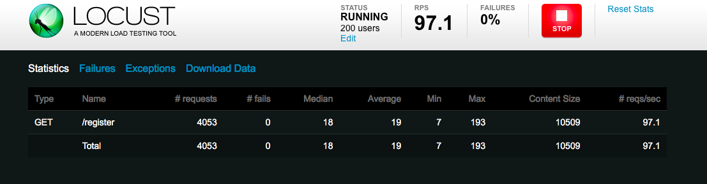
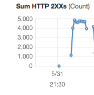
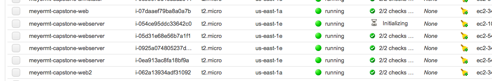
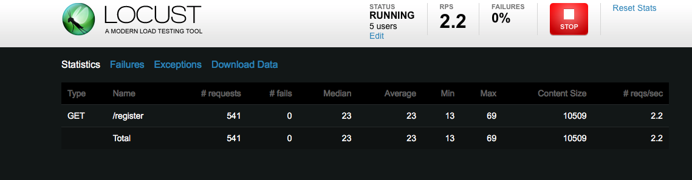
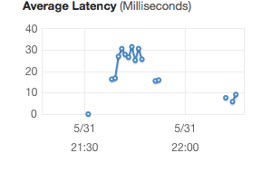
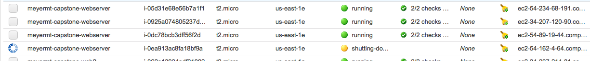
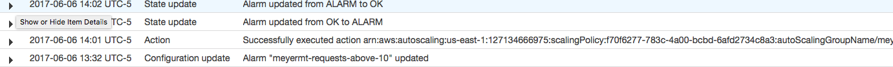
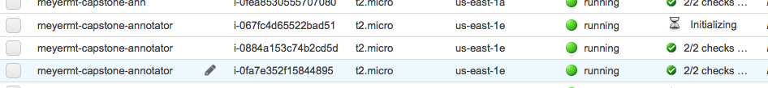

# Capstone Project
Capstone GAS Project for Michael Meyer

## Where are the Files?

**annotator/** All source files used in the annotator instances

**web/** All source files used in the web server instances

**utilities/** Utility processes for the GAS system (`results_notify.py`, `archiver.py`, `unarchiver.py`)

**test/** Test script used to test annotator

**user-data/** User data used to start up annotator and web instances

## Approach to the Glacier Archiver Job

For the archival job, I chose to implement a looping job that will continually look for records that are old enough in free user accounts to archive. When the job finds an entry to archive, it will do the following:

1. download file from S3 to a temp file
2. upload the file as an archive to Glacier
3. add the archive id to the DynamoDB table
4. delete the S3 file
5. delete the temp file

The job's current setup does have issues with scalability as-is. If you tried to scale out this process, you could potentially archive more than one copy of a free user's results (if two processes were processing the same file at the same time). The effect would only be more cost to you as an administrator.

So, this solution will only be able to be in place for as long as it can keep up with free user archival load. At that point, you would have to probably partition which users are processed as you scaled out. The good news is that the potential slowness in this process (assuming that the load is not constantly too big and it continues to grow) only means good things for free users, since they'll just have their results hanging around a little longer.

## Approach to the Glacier Premium User Thaw/Unarchiver Job

Making sure premium users are guaranteed a good experience seemed like a good reason to make the unarchiving process a little more scalable. Also, using a more scalable queueing approach in the unarchiving process is actually pretty straightforward with how boto3's API works. The unarchiving process does the following:

1. Upon premium membership, Glacier job for archived records initiated from web app.
2. Glacier job writes job result to SNS Topic for Glacier unarchiving
3. Unarchiving job loops and looks for queue messages.
4. Messages are used to get job output/file bytes
5. File is written back to S3
6. Archive ID is removed from DynamoDB entry

This approach effectively decouples to processes, the web app and the unarchiver, something that was much more important than in the archiving process. Because of the thawing time for these requests, it is much better to just use a queueing approach. Also, the decoupling allows us to more easily scale the unarchiving component separate from the web app component.

## Web Server Load Testing

I set my Locust testing to 200/20 for users/hatch rate and was able to see the web server instances scale out. You can see that there were plenty of reqs being sent per sec to achieve the alarm being alerted:

The first sign of a successful scale out was the alarm being alerted, which made sense from viewing the amount of requests that were coming in (and being served a 200 response) over time:

I then viewed the scale out in the EC2 console:

Afterwards, I stopped the test and lowered the users and hatch rate considerably (I think maybe 10/5), in order to send in requests at a rate that could be served fast (in less than 10 ms):

This did lower the latency:

This resulted in the scaling in of the web servers:

## Ann Server Load Testing

After much testing hardship (as is the nature of testing), I configured the alarm to scale after a SUM of 10 requests were received in a 5 minute period. Soon after that and kicking off a custom `test_ann.py` script (on the utilities node) that puts a message on my job request queue once every 5 seconds, I was able to see the alarm go off and then instance scale:

